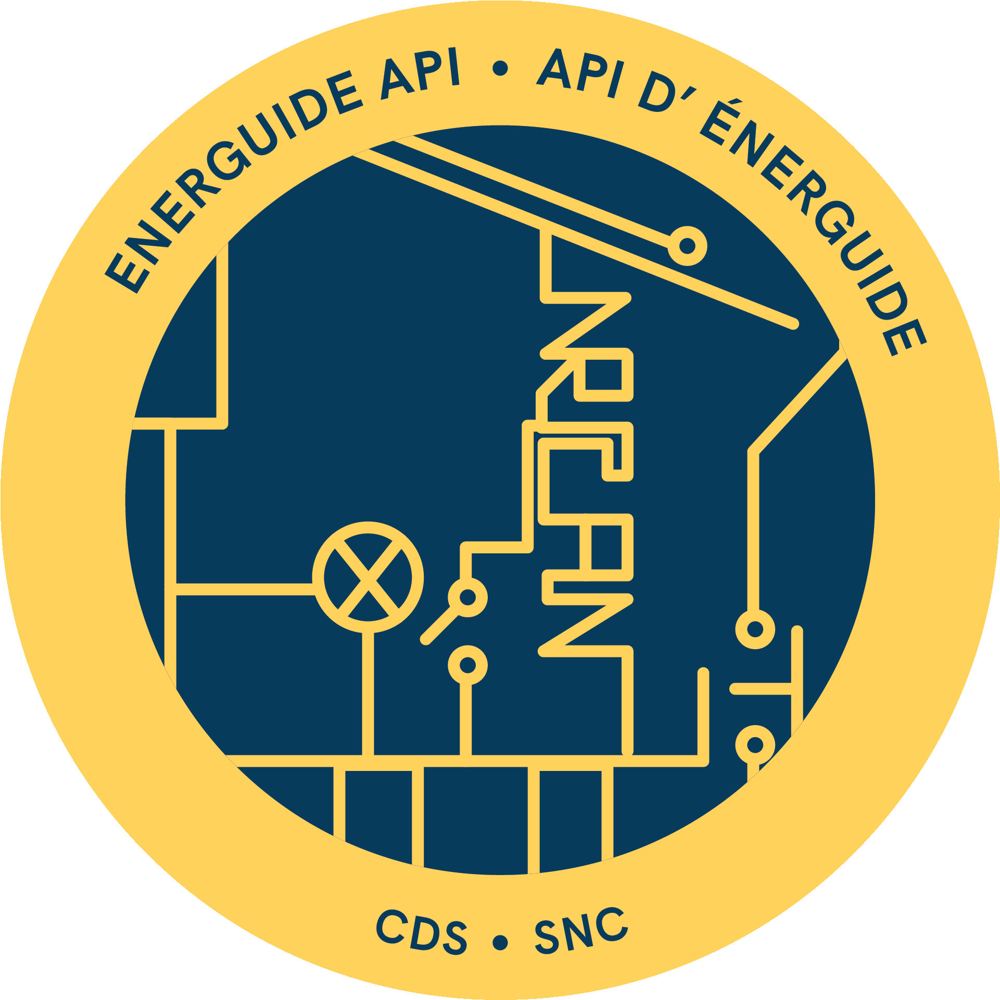
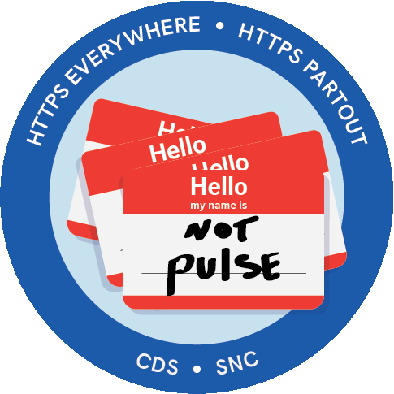

CDS has adopted the practice of mission patches, inspired by NASA, for each stage of one of it's products. I was involved with the EnerGuide API and the Track web security compliance projects (Known by many names, HTTPS Everywhere being one of), and received the above two badges.

My time at CDS has been great. I believe that I have learned more over the last eight months than any other similar time frame in my life. While I am leaving, I will be taking lessons learned here with me for the rest of my career.
